> * Windows下搭建Go语言开发环境<br>
> * 编写并运行第一个Go程序
<!-- more -->
## 1. Go开发包下载
go语言下载地址：[https://go.dev/dl/](https://go.dev/dl/)
* 直接下载最新版本go1.20
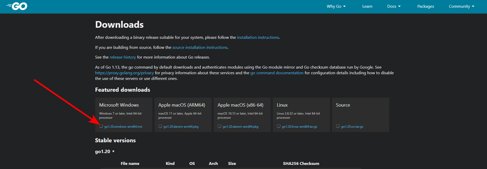

## 2. Go开发包安装
* 双击我们下载好的安装包.msi文件<br>
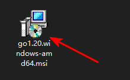


* 选择安装路径<br>
    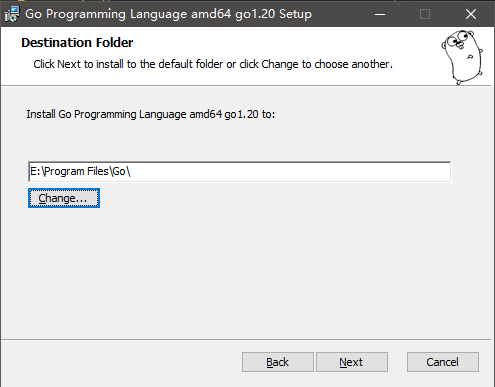


* 安装完成<br>
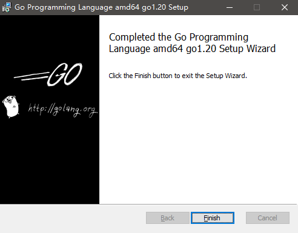


* 验证安装成功
  * 运行`go version`，命令行打印出go版本信息说明安装成功
```shell
C:\Users\root>go version
go version go1.20 windows/amd64
```

## 3. 编辑器安装
这里我们使用VSCode，有条件的朋友也可以选择Goland
### 3.1 下载安装VSCode
* VSCode下载地址：[code.visualstudio.com](code.visualstudio.com)<br>

根据开发环境选择相应的版本安装即可，过程同之前Go的安装，不再赘述
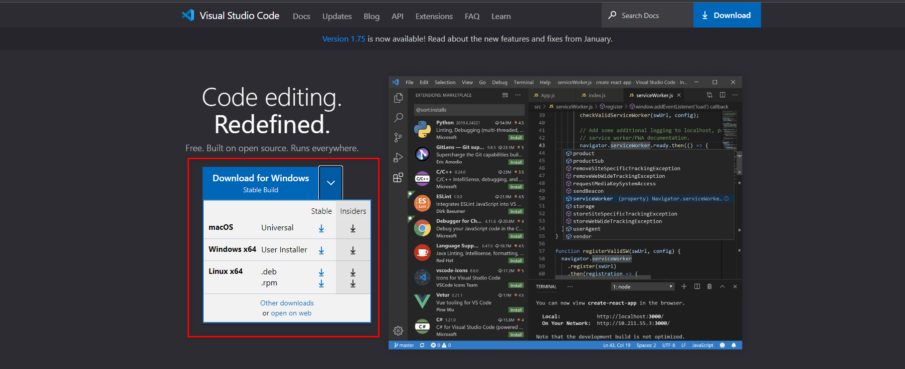

### 3.2 安装Go扩展
* 在VSCode编辑器界面，点击`扩展`图标<br>
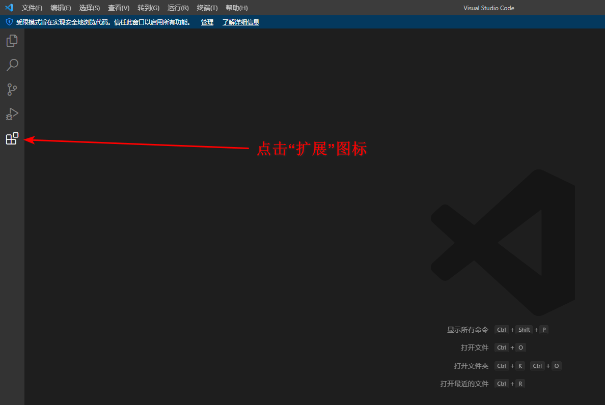

* 搜索并安装 Go扩展包<br>
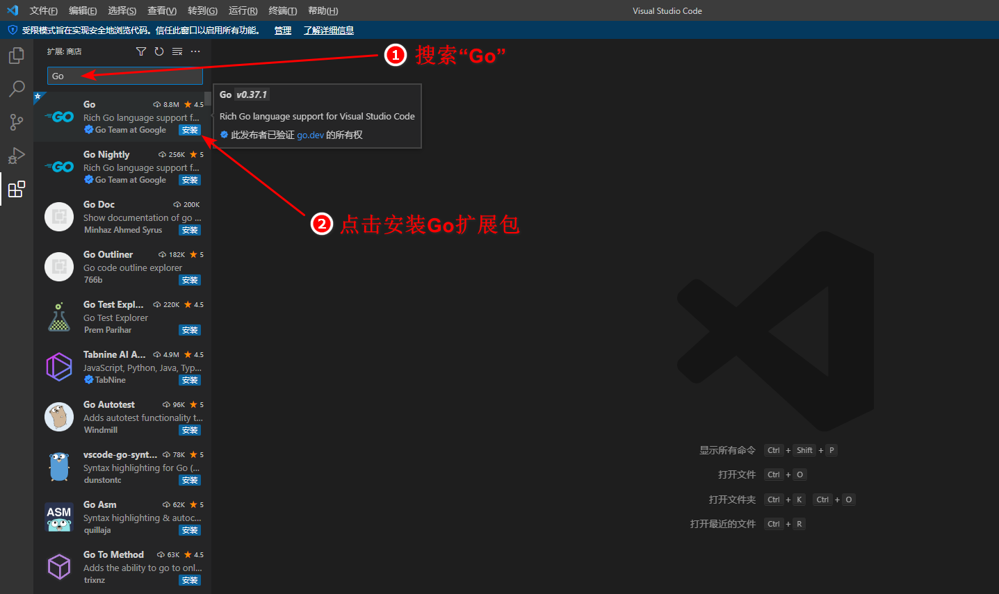

## 3.3 安装Go工具
* 打开VSCode`帮助>显示所有命令`界面
  * 点击`帮助` -> `显示所有命令`<br>
  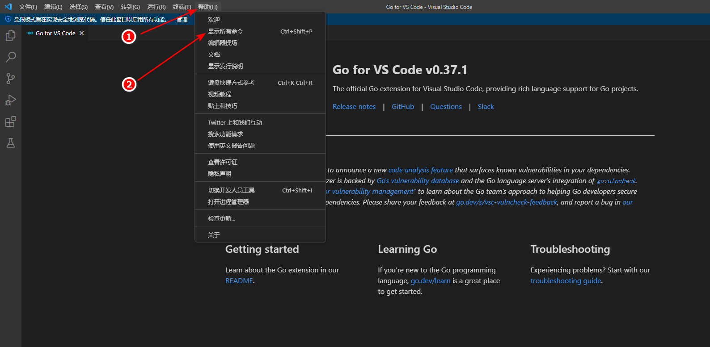
  * 或者直接使用快捷键`Ctrl+Shift+P`


* 搜索`Go: Install/Update Tools`并运行<br>
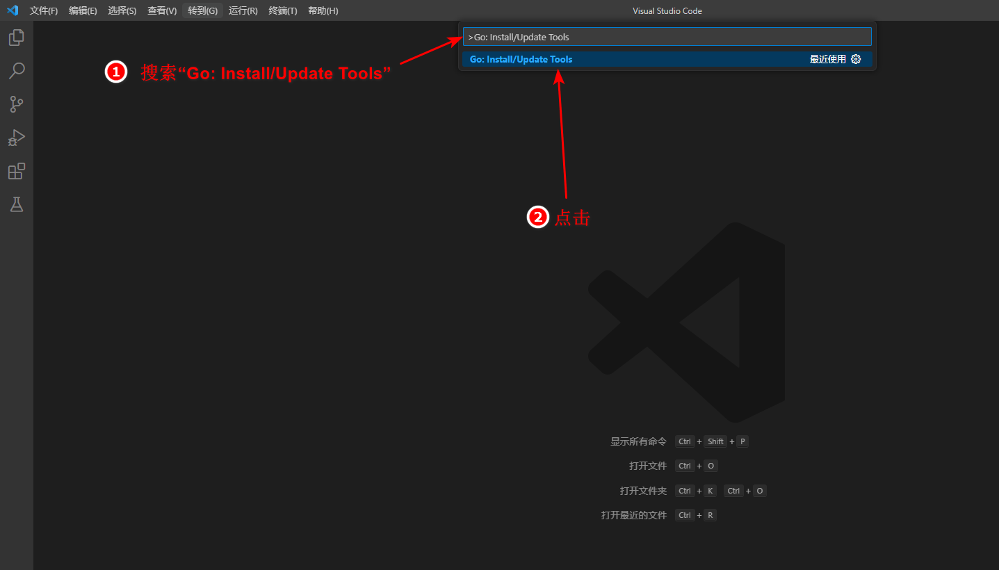


* 全选工具包并安装<br>
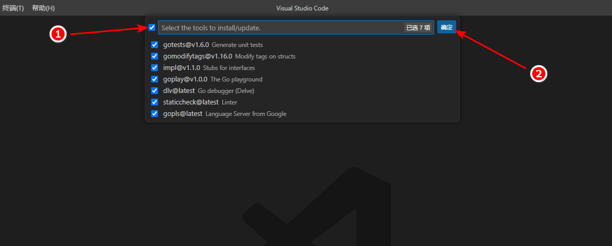

* 安装成功<br>
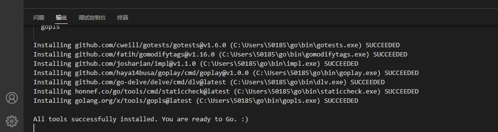

## 4. 第一个Go程序
### 4.1 创建项目文件
* 这里我们只需要新建一个文件夹，并在这个文件夹下添加一个main.go文件即可，如下<br>
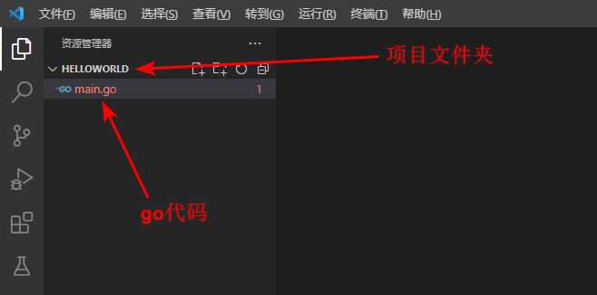

### 4.2 编写Go程序
```go
package main	// 声明包的名字

import (
	"fmt"	// 导入所需模块
)

func main() {	// 定义main主函数
	fmt.Println("Hello World!")	// 命令行打印 “Hello World!”
}

```

### 4.3 编译运行Go程序
现在我们已经有了main.go文件，接下来我们需要将之编译为二进制的可执行文件并运行。与之相关的go命令有两个：
* `go build`：将Go语言程序代码编译成二进制的可执行文件
* `go run`: 编译Go语言程序并直接运行程序的main函数，并且不会在当前目录留下可执行文件，适合用于程序调试

好，下面我们直接在VSCode的控制台运行`go run`命令
```shell
PS E:\Project\GolandProject\helloWorld> go run main.go    
Hello World!
```
程序运行成功
